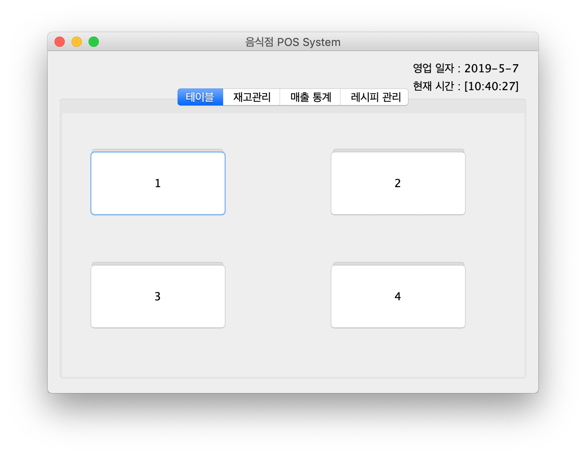
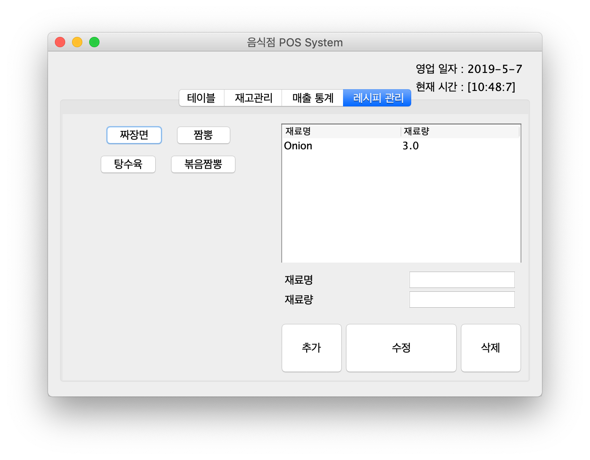
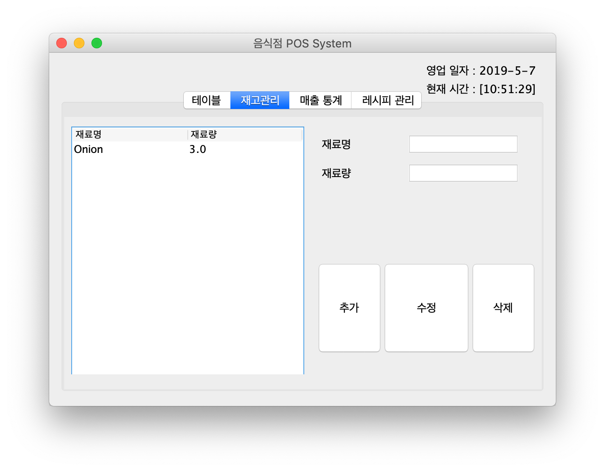
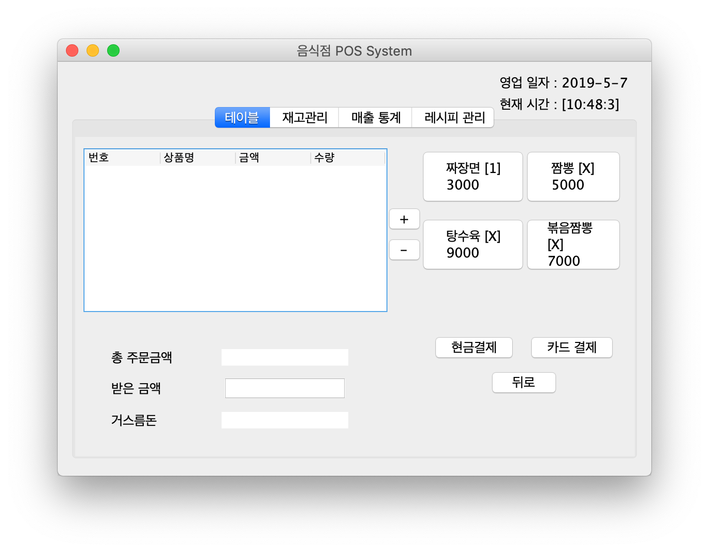

# POS System

Report of the Univ.　大学時代の課題物です。

## Point of Sales System

### 大学授業プロジェクト

- 飲食店のPOSシステム

- 大学の Object Oriented Design 授業でWaterfall工程で開発。

- JAVAのSwing Componentsを利用

- 担当作業

  - 文書作成

    - Requirement Specification
    - Use-case Scenario
    - Class Diagram
    - Sequence Diagram
    - Class Specification(クラス定義書)
    - User Interface Design

  - レシピ・材料管理機能作成（下記で説明）

    

     事前に定められているメニューのレシピを追加します。

    上記は"짜장면"というメニューにOnionが3.0 個が必要ということです。

    ​				

    ​	在庫管理にてレシピの材料を追加します。

    在庫管理にてレシピの材料を追加することで、お店で販売できる料理の数がカッコの中に表示されます。

    "짜장면"というメニューが一つ料理できます。

  #### 使用した技術

  - Java
  - Eclipse